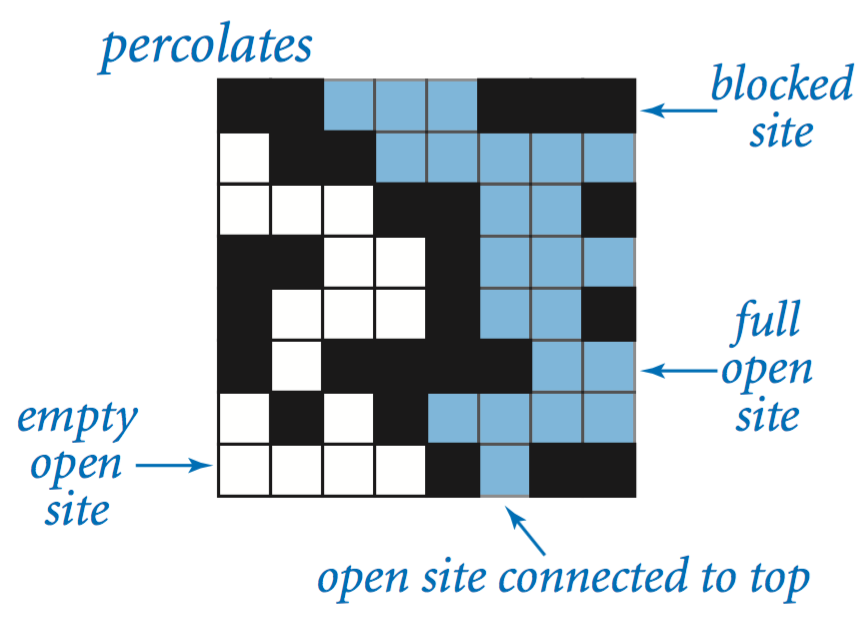
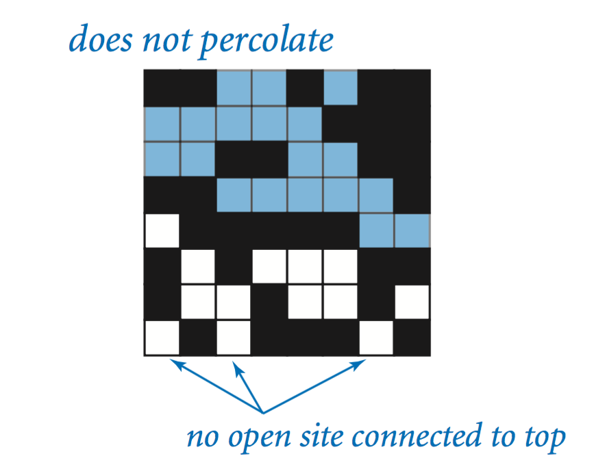
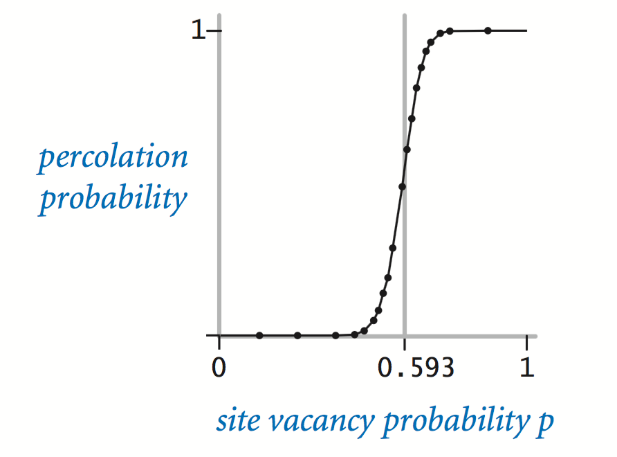
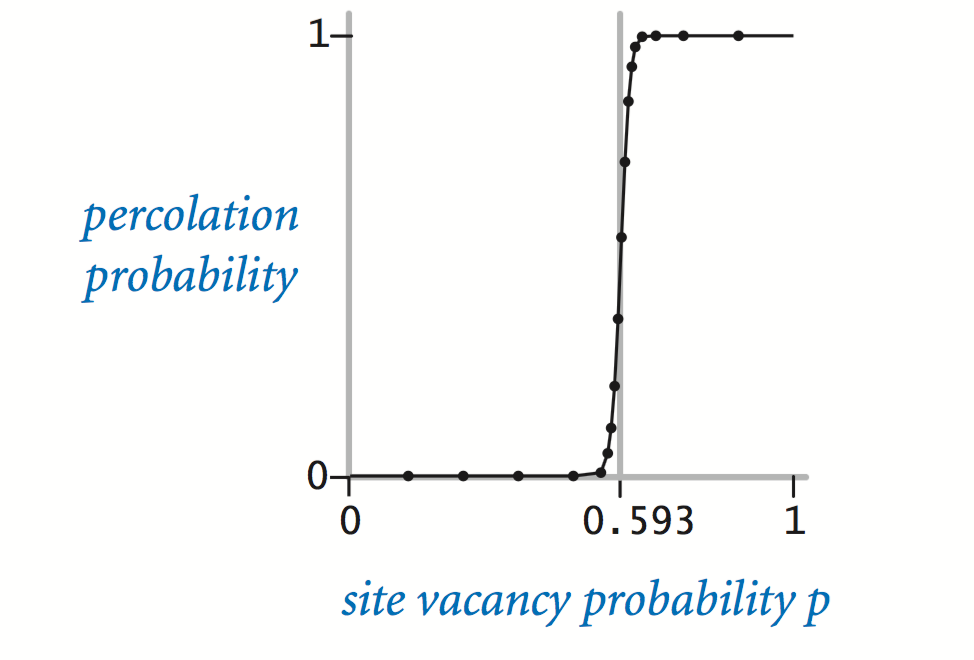

# Week 01 - Percolation

## Percolation

Given a composite systems comprised of randomly distributed insulating and metallic materials: what fraction of the materials need to be metallic so that the composite system is an electrical conductor? Given a porous landscape with water on the surface (or oil below), under what conditions will the water be able to drain through to the bottom (or the oil to gush through to the surface)? Scientists have defined an abstract process known as percolation to model such situations.

## The Model

We model a percolation system using an n-by-n grid of sites. Each site is either open or blocked. A full site is an open site that can be connected to an open site in the top row via a chain of neighboring (left, right, up, down) open sites. We say the system percolates if there is a full site in the bottom row. In other words, a system percolates if we fill all open sites connected to the top row and that process fills some open site on the bottom row. (For the insulating/metallic materials example, the open sites correspond to metallic materials, so that a system that percolates has a metallic path from top to bottom, with full sites conducting. For the porous substance example, the open sites correspond to empty space through which water might flow, so that a system that percolates lets water fill open sites, flowing from top to bottom.)

 




## The Problem

In a famous scientific problem, researchers are interested in the following question: if sites are independently set to be open with probability p (and therefore blocked with probability 1 − p), what is the probability that the system percolates? When p equals 0, the system does not percolate; when p equals 1, the system percolates. The plots below show the site vacancy probability p versus the percolation probability for 20-by-20 random grid (left) and 100-by-100 random grid (right).





When n is sufficiently large, there is a threshold value p* such that when p < p* a random n-by-n grid almost never percolates, and when p > p*, a random n-by-n grid almost always percolates. No mathematical solution for determining the percolation threshold p* has yet been derived. Your task is to write a computer program to estimate p*.


## Percolation Data Type

To model a percolation system, create a data type Percolation with the following API:

```java
public class Percolation {

    // creates n-by-n grid, with all sites initially blocked
    public Percolation(int n);

    // opens the site (row, col) if it is not open already
    public void open(int row, int col);

    // is the site (row, col) open?
    public boolean isOpen(int row, int col);

    // is the site (row, col) full?
    public boolean isFull(int row, int col);

    // returns the number of open sites
    public int numberOfOpenSites();

    // does the system percolate?
    public boolean percolates();

    // test client (optional)
    public static void main(String[] args);
}
```

_Corner cases._ By convention, the row and column indices are integers between 1 and n, where (1, 1) is the upper-left site: Throw an IllegalArgumentException if any argument to open(), isOpen(), or isFull() is outside its prescribed range. Throw an IllegalArgumentException in the constructor if n ≤ 0.

_Performance requirements._ The constructor must take time proportional to n^2; all instance methods must take constant time plus a constant number of calls to union() and find().